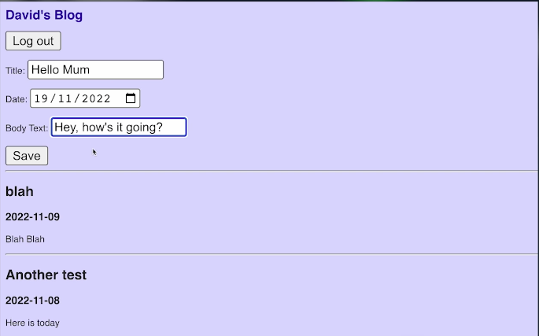

# 👉 Day 86 Challenge

Today's challenge is to build a fully functional blog engine.

1. Create a website with a 'login page'.
2. The login should work for **one** user only - you.
3. If you **are** logged in, you will see:
    1. A list of existing posts
    2. A way to add new posts (a text box with a submit button.) Submit adds the post to your blog using Replit db.
4. If you **aren't** logged in, you will see the blog entries (most recent first) on one continuous page.
5. This feed page will also have a 'login' button.

    
Example:

 
 💡 Hints 

  
- You can use `reversed` to, well, reverse a list and loop through in reverse order. Like this `for key in reversed(keys)`
- Use `.replace()` to overwrite dictionary items: `thisEntry = thisEntry.replace("{title}", db[key]["title"])`

